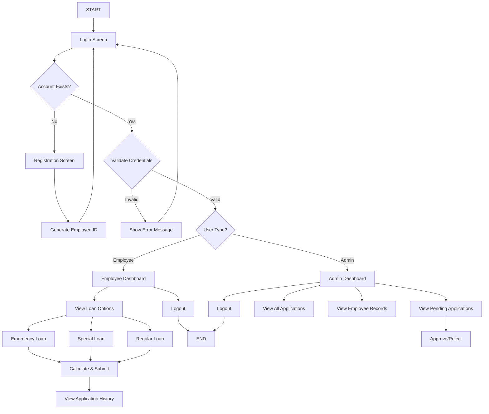
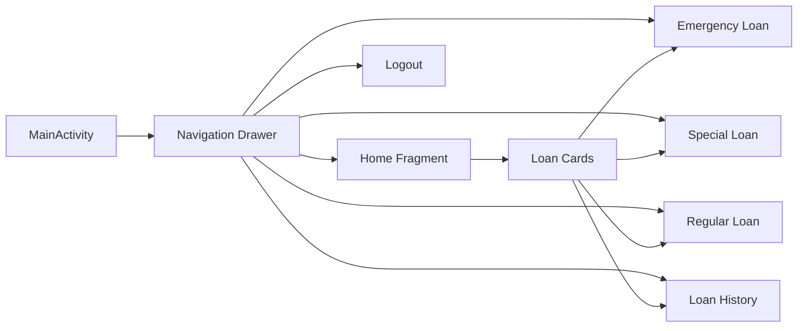
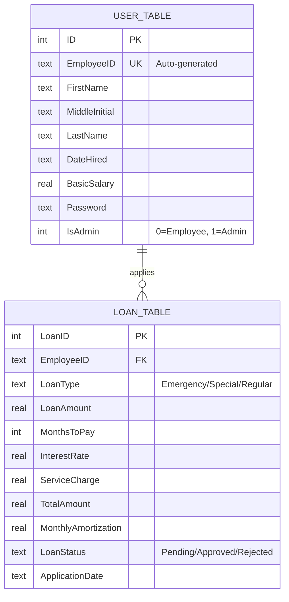

<div align="center">
  <h1>💰 ABC Credit Loan Management System</h1>
  <p><strong>A comprehensive Android application for managing employee loan applications and approvals</strong></p>
  
  
  
  
  
</div>

## Table of Contents
- [Project Overview](#-project-overview)
- [System Features](#-system-features)
- [Loan Types](#-loan-types)
- [System Architecture](#-system-architecture)
- [Installation Guide](#-installation-guide)
- [Default Credentials](#-default-credentials)
- [Database Schema](#-database-schema)
- [Troubleshooting](#-troubleshooting)
- [Development Guidelines](#-development-guidelines)

## 📋 Project Overview

This ABC Credit Loan Management System is developed in compliance with our subject ***"Mobile Development"*** as a finals project for companies requiring management of employee loan applications and processing. Built using **Android SDK** with **SQLite** for local database operations, the system provides a comprehensive platform for both administrators and employees.

The project includes:
- Dual interfaces (Admin and Employee)
- Secure authentication system
- Three types of loan applications (Emergency, Special, Regular)
- Automated loan computation with interest calculations
- Application approval workflow
- Comprehensive loan history tracking

### Technical Stack
- **Language**: Java 11
- **Platform**: Android SDK 24+ (Android 7.0 Nougat and above)
- **Target SDK**: Android 14 (API 36)
- **Database**: SQLite (Local Storage)
- **UI Framework**: Material Design 3 with Navigation Components
- **Architecture**: MVVM Pattern with View Binding

## ✨ System Features

### Admin Dashboard
- **Pending Applications**: View and approve/reject pending loan applications
- **All Applications**: Monitor all loan applications with status tracking
- **Employee Records**: Access and manage employee information
- **Application Statistics**: Real-time count of pending and approved loans
- **Secure Logout**: End admin session securely

### Employee Portal
- **Loan Applications**: Apply for three different types of loans
  - Emergency Loan (₱5,000 - ₱25,000)
  - Special Loan (₱50,000 - ₱100,000)
  - Regular Loan (₱5,000 - ₱500,000)
- **Loan Calculator**: Real-time computation with interest and service charges
- **Application History**: View all past loan applications and their statuses
- **Profile Management**: View employee information and ID
- **Secure Logout**: End session securely

## 💳 Loan Types

### 1. Emergency Loan
**Quick financial assistance for urgent needs**

| Feature | Details |
|---------|---------|
| **Amount Range** | ₱5,000 - ₱25,000 |
| **Service Charge** | 1% of loan amount |
| **Interest Rate** | 0.6% per month |
| **Repayment Period** | 6 months fixed |
| **Payment Options** | Monthly installment or Cash after 6 months |

**Computation Formula:**
```
Service Charge = Loan Amount × 1%
Interest = Loan Amount × 6 months × 0.6%
Total Payment = Loan Amount + Service Charge + Interest

If Monthly: Monthly Payment = Total Payment ÷ 6
If Cash: Pay total after 6 months
```

**Example Calculation (₱10,000 loan):**
- Service Charge: ₱100.00
- Interest (6 months): ₱360.00
- Total Payment: ₱10,460.00
- Monthly Payment: ₱1,743.33

### 2. Special Loan
**Medium-term loans for significant expenses**

| Feature | Details |
|---------|---------|
| **Amount Range** | ₱50,000 - ₱100,000 |
| **Interest Rate** | Tiered (0.6% - 1.0%) |
| **Repayment Period** | 1 - 18 months (flexible) |
| **Service Charge** | None |

**Interest Rate Structure:**

| Duration | Interest Rate per Month |
|----------|------------------------|
| 1-6 months | 0.6% |
| 7-12 months | 0.8% |
| 13-18 months | 1.0% |

**Computation Formula:**
```
Interest Rate = Based on months to pay (see table above)
Total Interest = Loan Amount × Months × Interest Rate
Total Amount = Loan Amount + Total Interest
Monthly Payment = Total Amount ÷ Months
```

**Example Calculation (₱75,000 for 12 months):**
- Interest Rate: 0.8%
- Total Interest: ₱7,200.00
- Total Amount: ₱82,200.00
- Monthly Payment: ₱6,850.00

### 3. Regular Loan
**Large loans for major investments**

| Feature | Details |
|---------|---------|
| **Amount Range** | ₱5,000 - ₱500,000 |
| **Interest Rate** | Tiered (0.5% - 1.5%) |
| **Repayment Period** | 1 - 60 months (flexible) |
| **Service Charge** | None |

**Interest Rate Structure:**

| Duration | Interest Rate per Month |
|----------|------------------------|
| 1-12 months | 0.5% |
| 13-24 months | 0.8% |
| 25-36 months | 1.0% |
| 37-48 months | 1.2% |
| 49-60 months | 1.5% |

**Computation Formula:**
```
Interest Rate = Based on months to pay (see table above)
Total Interest = Loan Amount × Months × Interest Rate
Total Amount = Loan Amount + Total Interest
Monthly Payment = Total Amount ÷ Months
```

**Example Calculation (₱200,000 for 36 months):**
- Interest Rate: 1.0%
- Total Interest: ₱72,000.00
- Total Amount: ₱272,000.00
- Monthly Payment: ₱7,555.56

## 🏗️ System Architecture

### Application Flow



### Navigation Structure



## 🗄️ Database Schema

### Entity Relationship Diagram



### Database Tables

#### 1. user_table
Stores employee and admin account information.

| Column | Type | Constraints | Description |
|--------|------|-------------|-------------|
| ID | INTEGER | PRIMARY KEY, AUTOINCREMENT | System-generated user ID |
| EmployeeID | TEXT | UNIQUE | Generated format: [Initial][5-digit] |
| FirstName | TEXT | NOT NULL | Employee first name |
| MiddleInitial | TEXT | | Middle initial |
| LastName | TEXT | NOT NULL | Employee last name |
| DateHired | TEXT | NOT NULL | Hiring date (MM-DD-YYYY) |
| BasicSalary | REAL | NOT NULL | Monthly basic salary |
| Password | TEXT | NOT NULL | Account password |
| IsAdmin | INTEGER | DEFAULT 0 | 0 = Employee, 1 = Admin |

**Employee ID Generation:**
```
Format: [First Initial][Last Initial][5-digit Random Number]
Example: John Smith → JS12345
```

#### 2. loan_table
Stores all loan applications and their details.

| Column | Type | Constraints | Description |
|--------|------|-------------|-------------|
| LoanID | INTEGER | PRIMARY KEY, AUTOINCREMENT | System-generated loan ID |
| EmployeeID | TEXT | FOREIGN KEY | References user_table |
| LoanType | TEXT | NOT NULL | Emergency/Special/Regular |
| LoanAmount | REAL | NOT NULL | Requested loan amount |
| MonthsToPay | INTEGER | NOT NULL | Repayment duration |
| InterestRate | REAL | NOT NULL | Applied interest rate |
| ServiceCharge | REAL | DEFAULT 0 | Applicable service charge |
| TotalAmount | REAL | NOT NULL | Total amount to pay |
| MonthlyAmortization | REAL | NOT NULL | Monthly payment amount |
| LoanStatus | TEXT | DEFAULT 'Pending' | Pending/Approved/Rejected |
| ApplicationDate | TEXT | NOT NULL | Application submission date |

## 📥 Installation Guide

### Prerequisites
- **Android Studio**: Hedgehog (2023.1.1) or later
- **Java JDK**: Version 11 or higher
- **Android SDK**: API Level 24 or higher
- **Gradle**: 8.12.3 or compatible version

### 1. Clone the Repository

```bash
# Clone via command line
git clone https://github.com/Blanky37/MobileDev_Finals.git

# Or in Android Studio
# File → New → Project from Version Control
# Enter URL: https://github.com/Blanky37/MobileDev_Finals
```

### 2. Open Project in Android Studio

1. Launch Android Studio
2. Click **File → Open**
3. Navigate to the cloned project folder
4. Select the `MobileDev_Finals` folder
5. Click **OK**

### 3. Gradle Sync

Android Studio will automatically:
- Download required dependencies
- Configure build tools
- Set up the project structure

If auto-sync fails:
1. Click **File → Sync Project with Gradle Files**
2. Wait for the sync to complete

### 4. Configure Build Variants

1. In Android Studio, click **Build → Select Build Variant**
2. Select **debug** for development
3. Select **release** for production builds

### 5. Run the Application

#### Option A: Using Emulator
1. Click **Tools → Device Manager**
2. Create a new virtual device (if none exists):
   - Select a device definition (e.g., Pixel 5)
   - Choose a system image (API 24+)
   - Finish setup
3. Click the **Run** button (▶️) or press `Shift + F10`
4. Select your emulator from the list

#### Option B: Using Physical Device
1. Enable **Developer Options** on your Android device:
   - Go to **Settings → About Phone**
   - Tap **Build Number** 7 times
2. Enable **USB Debugging**:
   - Go to **Settings → Developer Options**
   - Toggle **USB Debugging** ON
3. Connect device via USB
4. Click **Run** (▶️) and select your device

### 6. Verify Installation

Upon successful installation, you should see:
- Login screen with ABC Credit Loan System branding
- Option to register or login
- No compilation errors in the build output

## 🔑 Default Credentials

### Administrator Account
```
Employee ID: ADMIN001
Password: admin123
```

**Admin Capabilities:**
- View all pending loan applications
- Approve or reject applications
- View all applications (approved, pending, rejected)
- View all employee records
- Access to full system statistics

### Test Employee Account
Register a new employee account to test the employee features:
1. Click "Register here" on the login screen
2. Fill in the registration form
3. System will auto-generate an Employee ID
4. Use the generated ID and password to login

## 🔧 Troubleshooting

### Common Issues and Solutions

| Issue | Solution |
|-------|----------|
| **Gradle sync failed** | 1. Check internet connection<br>2. File → Invalidate Caches / Restart<br>3. Update Gradle wrapper to latest version |
| **App crashes on startup** | 1. Check logcat for error messages<br>2. Clean and rebuild project<br>3. Verify minimum SDK version (24+) |
| **Database not creating** | 1. Uninstall and reinstall the app<br>2. Check storage permissions<br>3. Verify DatabaseHelper initialization |
| **Login always fails** | 1. Check if database is properly initialized<br>2. Verify admin account creation in onCreate()<br>3. Check password input (case-sensitive) |
| **Navigation not working** | 1. Verify navigation graph setup<br>2. Check fragment IDs in navigation XML<br>3. Ensure NavController is properly initialized |
| **UI elements not displaying** | 1. Check View Binding is enabled<br>2. Verify layout XML files exist<br>3. Clean and rebuild project |

### Build Issues

#### Issue: "ViewBinding is not generated"
```bash
Solution:
1. Ensure in app/build.gradle.kts:
   buildFeatures {
       viewBinding = true
   }
2. Sync Gradle Files
3. Rebuild Project
```

#### Issue: "Cannot resolve symbol 'databinding'"
```bash
Solution:
1. Check that viewBinding is enabled
2. Clean Project (Build → Clean Project)
3. Rebuild Project (Build → Rebuild Project)
4. Invalidate Caches (File → Invalidate Caches / Restart)
```

#### Issue: "SQLite database locked"
```bash
Solution:
1. Ensure database cursor is closed after use
2. Close database connection when not needed
3. Use try-with-resources for cursor management
```

### Debugging Tips

1. **Enable Logcat Filtering**
   ```
   Tag: ABC_Loan | Level: Debug
   ```

2. **Check Database Contents**
   - Use Device File Explorer
   - Navigate to: `/data/data/com.example.aquino_bembo_finals/databases/`
   - Pull `ABCCreditLoanSystem.db` to inspect with SQLite browser

3. **Monitor Fragment Lifecycle**
   - Add logs in onCreateView, onViewCreated, onDestroyView
   - Verify proper navigation and data passing

## 📝 Development Guidelines

### Code Structure

```
app/src/main/java/com/example/aquino_bembo_finals/
├── admin/                      # Admin-specific activities
│   ├── AdminHome.java
│   ├── AdminLogout.java
│   ├── PendingApplicationsView.java
│   ├── AllApplicationsView.java
│   └── AllRecordsView.java
├── initial/                    # Authentication activities
│   ├── Login.java
│   └── Registration.java
├── ui/                         # User fragments (MVVM)
│   ├── home/
│   │   ├── HomeFragment.java
│   │   └── HomeViewModel.java
│   ├── emergencyloan/
│   ├── specialloan/
│   ├── regularloan/
│   ├── history/
│   └── logout/
├── DatabaseHelper.java         # SQLite database operations
├── LoanComputation.java        # Business logic for calculations
└── MainActivity.java           # Main navigation container
```

### Naming Conventions

#### Java Classes
```java
// Activity classes - PascalCase with descriptive suffix
AdminHome.java
PendingApplicationsView.java
MainActivity.java

// Fragment classes - PascalCase with Fragment suffix
HomeFragment.java
EmergencyLoanFragment.java

// Helper classes - PascalCase with Helper/Manager suffix
DatabaseHelper.java
LoanComputation.java
```

#### Layout Files
```xml
<!-- Activity layouts - activity_[name].xml -->
activity_login.xml
activity_admin_home.xml

<!-- Fragment layouts - fragment_[name].xml -->
fragment_home.xml
fragment_emergency_loan.xml

<!-- Custom views - card_[name].xml -->
card_application.xml
card_history.xml
```

#### Resource IDs
```xml
<!-- Format: [type]_[name]_[description] -->
<TextView android:id="@+id/tv_employee_name" />
<Button android:id="@+id/btn_submit_application" />
<EditText android:id="@+id/et_loan_amount" />
<TextInputLayout android:id="@+id/til_password" />
```

### Best Practices

#### 1. Database Operations
```java
// Always close cursors and database connections
Cursor cursor = db.getAllLoans();
try {
    // Process cursor data
    while (cursor.moveToNext()) {
        // Extract data
    }
} finally {
    cursor.close();
}
```

#### 2. View Binding
```java
// Use view binding instead of findViewById
private FragmentHomeBinding binding;

@Override
public View onCreateView(@NonNull LayoutInflater inflater,
                         ViewGroup container, Bundle savedInstanceState) {
    binding = FragmentHomeBinding.inflate(inflater, container, false);
    return binding.getRoot();
}

@Override
public void onDestroyView() {
    super.onDestroyView();
    binding = null; // Prevent memory leaks
}
```

#### 3. Input Validation
```java
// Validate before processing
if (loanAmount < 5000 || loanAmount > 25000) {
    showErrorDialog("Invalid Amount", 
        "Emergency loan must be between ₱5,000 and ₱25,000");
    return;
}
```

#### 4. Error Handling
```java
// Use callback interfaces for error communication
public interface LoanErrorListener {
    void onLoanError(String title, String message);
}

// Implement in activities/fragments
LoanComputation.calculateEmergencyLoan(amount, isCash, 
    (title, message) -> showErrorDialog(title, message));
```

### Git Workflow

#### Branch Naming
```
feature/loan-calculator
bugfix/login-validation
hotfix/database-crash
enhancement/ui-improvements
```

#### Commit Messages
```
feat: Add loan history fragment
fix: Correct interest rate calculation for special loans
docs: Update README with installation steps
style: Format code according to Java conventions
refactor: Extract loan computation to separate class
test: Add unit tests for LoanComputation class
```

#### Pull Request Checklist
- ✅ Code follows project naming conventions
- ✅ All new features include appropriate validation
- ✅ Database cursors are properly closed
- ✅ View binding is used instead of findViewById
- ✅ No hardcoded strings (use strings.xml)
- ✅ App builds without errors or warnings
- ✅ Tested on emulator and/or physical device
- ✅ No sensitive data (passwords, API keys) committed

### Testing Guidelines

#### Manual Testing Checklist

**Authentication:**
- [x] Login with valid admin credentials
- [x] Login with valid employee credentials
- [x] Login with invalid credentials shows error
- [x] Register new employee account
- [ ] Duplicate employee ID prevented
- [x] Password validation working

**Loan Applications:**
- [ ] Emergency loan within valid range
- [ ] Emergency loan rejects invalid amounts
- [ ] Special loan interest rate correct per tier
- [ ] Regular loan interest rate correct per tier
- [ ] Service charges calculated correctly
- [ ] Monthly payments computed accurately

**Admin Functions:**
- [ ] Pending applications display correctly
- [ ] Approve application updates status
- [ ] Reject application updates status
- [ ] Statistics update after approval/rejection
- [ ] All records view shows complete data

**Navigation:**
- [ ] Drawer menu opens and closes
- [ ] All menu items navigate correctly
- [ ] Back button behavior is correct
- [ ] Logout returns to login screen

## 📚 Dependencies

### Core Dependencies
```kotlin
dependencies {
    // Android Core
    implementation(libs.appcompat) // 1.7.1
    implementation(libs.activity) // 1.12.0
    implementation(libs.constraintlayout) // 2.2.1
    
    // Material Design
    implementation(libs.material) // 1.13.0
    
    // Navigation Components
    implementation(libs.navigation.fragment) // 2.9.6
    implementation(libs.navigation.ui) // 2.9.6
    
    // Lifecycle Components (MVVM)
    implementation(libs.lifecycle.livedata.ktx) // 2.10.0
    implementation(libs.lifecycle.viewmodel.ktx) // 2.10.0
    
    // Testing
    testImplementation(libs.junit)
    androidTestImplementation(libs.ext.junit)
    androidTestImplementation(libs.espresso.core)
}
```

## 🔄 Future Enhancements

### Planned Features
1. **Push Notifications**: Alert employees when loan status changes
2. **Loan Repayment Tracking**: Monitor payment schedules and due dates
3. **Document Upload**: Attach supporting documents to applications
4. **Biometric Authentication**: Fingerprint/face recognition login
5. **Cloud Sync**: Backup data to cloud storage
6. **Multi-language Support**: Localization for other languages
7. **Dark Mode**: System-wide dark theme support
8. **Export Reports**: Generate PDF reports for applications
9. **In-app Messaging**: Communication between admin and employees
10. **Payment Integration**: Connect with payment gateways

### Known Limitations
- Offline-only operation (no network sync)
- Single admin account (no role management)
- No loan repayment tracking
- Limited to one device (no multi-device sync)
- No data export functionality

## 🔐 Security Considerations

### Current Implementation
- Passwords stored in plain text (SQLite database)
- Local authentication only
- No encryption for sensitive data
- Session management via SharedPreferences

### Recommended Improvements for Production
```java
// Use Android Keystore for password encryption
// Implement password hashing (BCrypt/Argon2)
// Add biometric authentication
// Implement certificate pinning for network calls
// Use encrypted SharedPreferences
// Add session timeout mechanism
```

## 📄 License

This project is developed for educational purposes as part of the Mobile Development course finals requirement.

---

<div align="center">
  <p>Developed by <strong>Aquino & Bembo</strong> | De La Salle University – Dasmariñas</p>
  <p>Final Project for <strong>Mobile Development 2025</strong></p>
  <p>📱 Android Application | 💾 SQLite Database | 🎨 Material Design 3</p>
</div>
